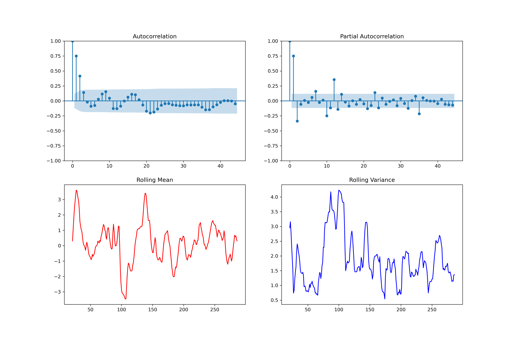
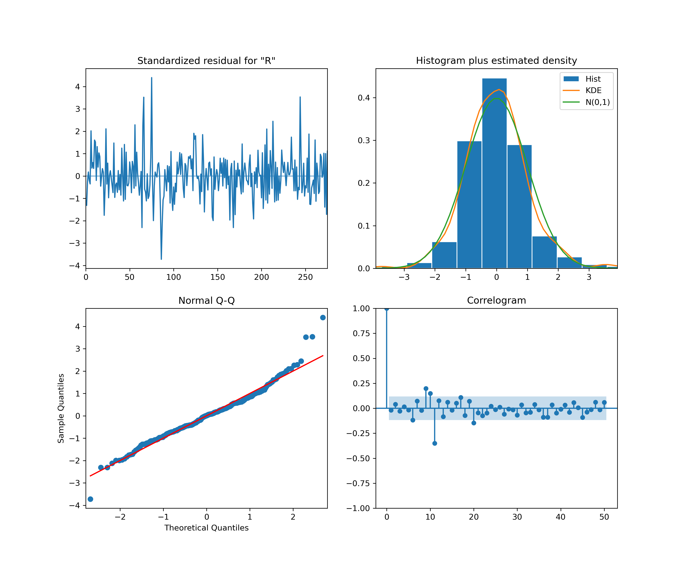
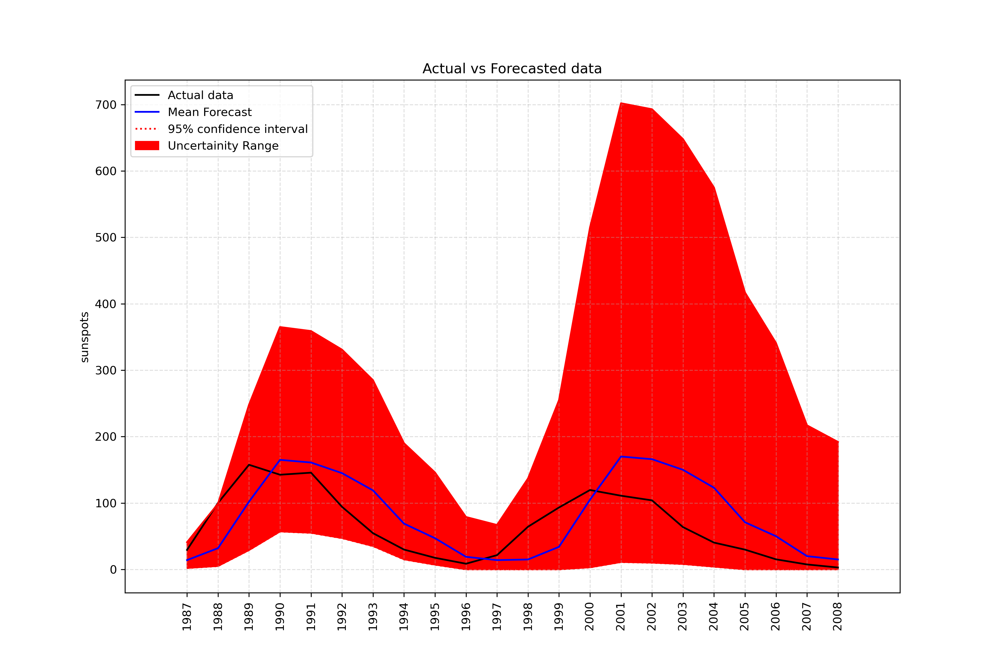

1. Sunspot Firecasting by AR model
#selection of model

Judging from nature of acf and pacf plot, AR model is best suited. Pacf has sharp cutoff after lag 2. AR(2) is selected.

#validation of model

Standarized residual for "R" is constant over time,proving model is unbiased. The standarized residual plot follows a normal distribution but exhibit heavy tails, as shown in Q-Q curve. Except for lag 0, the correlation of residual at any lag is inside threshold,which coforms our model captures perfectly caputered the relation of data,leaving behind white noise.We move forward eith AR(2) model for forecasting. 

#Forecasting

The AR(2) model successfully forecasted sunspot data within actual data scales and captured solar mimima very well.Although, we supposed a fixed 11 year seasonal pattern, the seasonal pattern is varied from 9-12 years due to irregular nature of solar cycles. A fixed 11 year historical window caused a phase shift in long horizons (2002 peak). Model can be further improved by using dynamic model, that incorporates seasonal shift.
