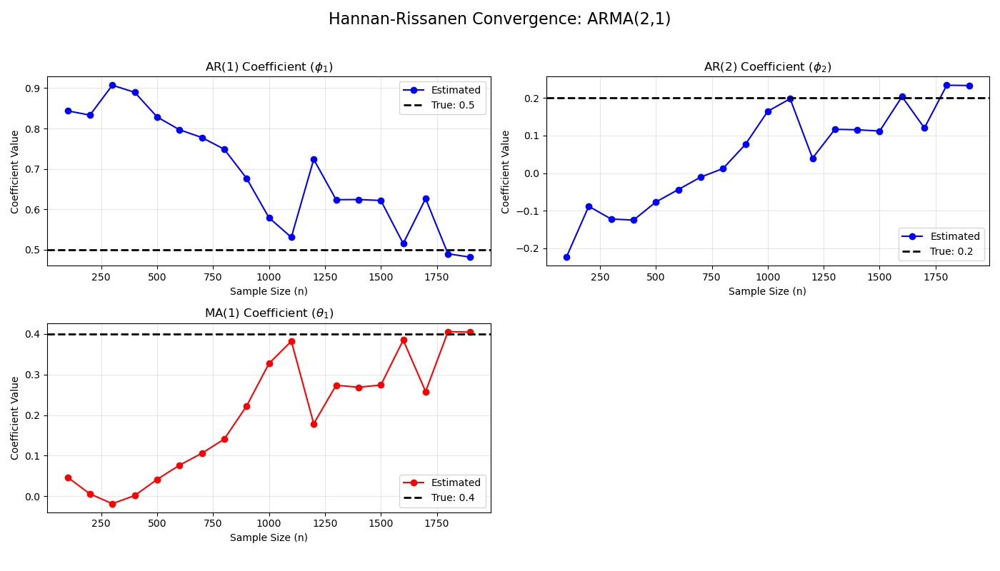
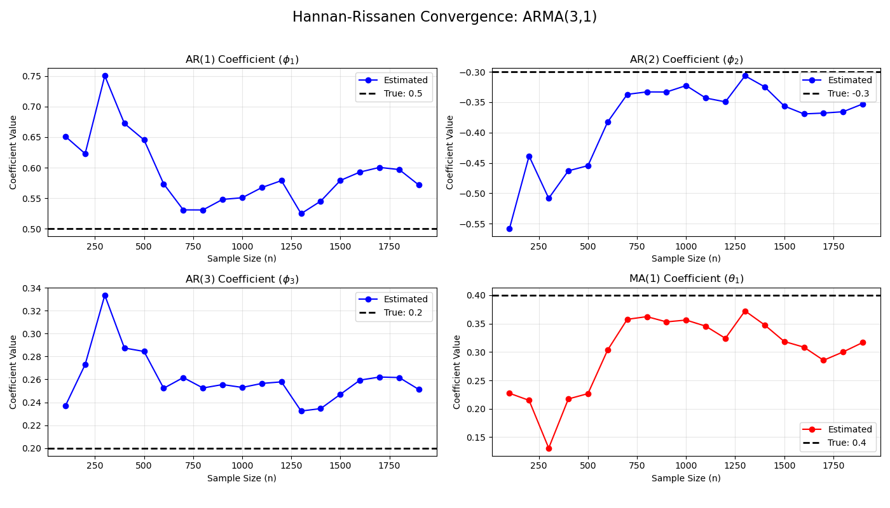

Hannan-Rissanen_Algorithm
[Click here](https://github.com/shiva7579/Time_series_analysis_portfolio/blob/main/3_Hannan-Rissanen_Algorithm/Hannan-Rissanen.ipynb)

 
Hannan-Rissanen is non-expensive alogorithm with a two-step OLS approach, enabling closed-form estimation and rapid model order grid screening for mixed ARMA models.
It may replace computationally expensive non-linear MLE model. 

 
For small sample size (n<500), there is estimation variance and noticeable bias. $\phi_1$ is initially overestimated ($\approx 0.85$), while $\phi_2$ and $\theta_1$ are severely underestimated.Large Samples ($n \ge 1500$): As sample grows, all three parameter paths converge directly onto their true population values, demonstrating asymptotic consistency as the residual proxy approaches true white noise. 

 
For higher order ARMA model,increasing the AR order to $p=3$ introduces slight residual variance even at larger sample sizes, but the structural trends remain consistent.The moving-average component ($\theta_1$) climbs from an initial low of $0.13$ ($n=300$) to lock within a narrow error band around $0.35 - 0.40$ for $n \ge 800$. 
