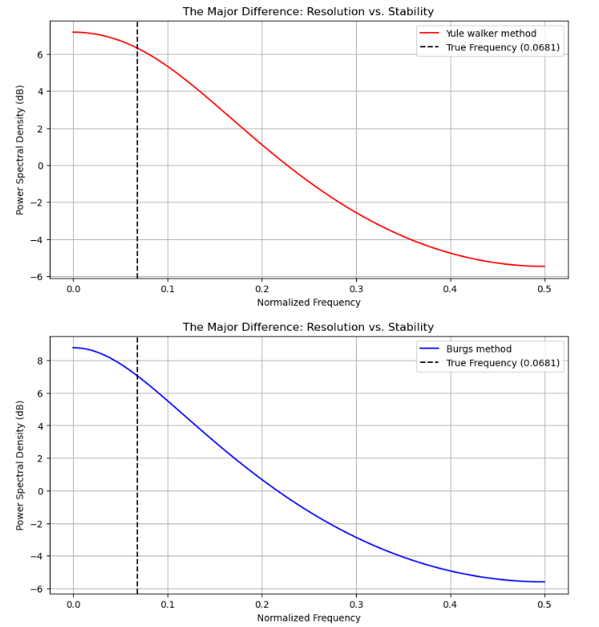
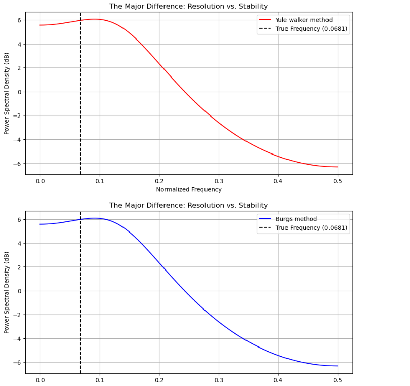

2. Yule-Walker vs Burgs Algorithm 
This projects is about comparing the parametric spectral estimation across varying sample size. Both algoriths are coded manually from strach using linear algebra and matix mechanics.A custom biased autocorrelation loop was mapped into a symmetric Toeplitz matrix equation to solve the Yule-Walker parameters, while a stage-by-stage lattice filter recursion loop was programmed to extract Burg's reflection coefficients by natively minimizing forward and backward prediction errors. 

#for small sample size 
 
In case of small sample size,Yule walker performs poor because of global 1/N scaling windowing constraints and boundary shrinkage fraction(i/N) is high.Both yule walker and burgs fails to attain true coefficients because of estimation bias. But Burgs algorithm prediction is slightly better than yule wlakers and burgs holds higher signal energy due to its lattice based minimization of forward and backward errors. 

#for large sample size 
 
As the sample size increases, the coefficents obtained by both method are nearly same. Because as the sample size increase the boundary shrinkage fraction(i/N) decreases. When boundary edge is minimized , the global Toeplitz matrix yields same vector projection as Burg's lattice minimixation. both algorithms successfully estimate coefficients very close to true coefficients, resulting in virtually identical power spectral density curve.
